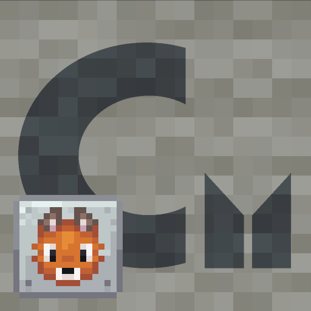

<h1 align="center">Carpet: NeoForged</h1>

Fork of gnembon's [Carpet Mod](https://github.com/gnembon/fabric-carpet) ported to NeoForge

 
 

<h2>Compatibility</h2>

A few Carpet extension mods will work when using [Sinytra Connector](https://github.com/Sinytra/Connector), namely less mixin-heavy ones (most scarpet extensions should work fine).
